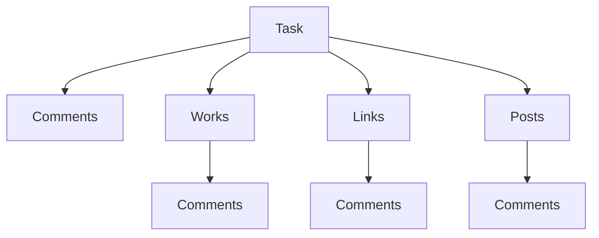
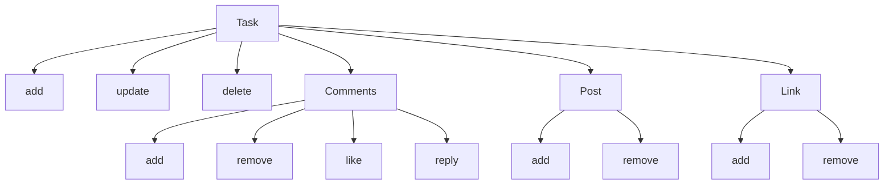

# Task Module
## Management of tasks

### Relation

```mermaid
graph TD;
    Task-->TaskComments[Comments];
    Task-->Works-->WorkComments[Comments];
    Task-->Links-->LinkComments[Comments];
    Task-->Posts-->PostComments[Comments];
```

### Actions

```mermaid
graph TD;
    Task-->add;
    Task-->update;
    Task-->delete;
    Task-->Comments;
    Comments-->AddComments[add];
    Comments-->RemoveComments[remove];
    Comments-->LikeComments[like];
    Comments-->ReplyComments[reply];
    Task-->Post;
    Post-->AddPost[add];
    Post-->RemovePosts[remove];
    Task-->Link;
    Link-->AddLinks[add];
    Link-->RemoveLinks[remove];
    
```
