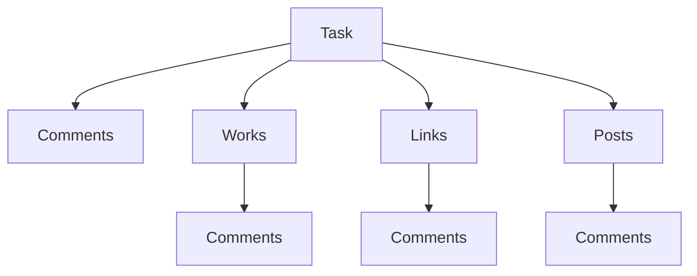
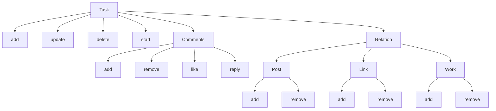

# Task Module
## Management of tasks

### Dependencies

#### Modules

1. [**App**](https://github.com/DviDev/app-module) - Gerenciamento de informações ```*genéricas```

> 🤖 Informações genéricas geralmente não se enquadram em nenhum módulo.

2. [**Workspace**](https://github.com/DviDev/app-module) - Categorização via ```Espaços``` de trabalho

> 🤖 Espaços de trabalhos ajudam a organizar a informação.

### Relation



### Actions

